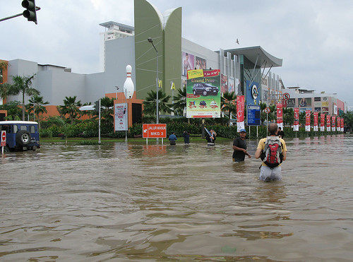
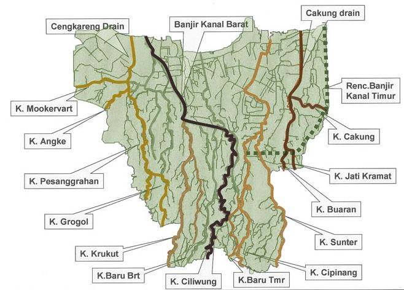

```{r, results='hide', warning = FALSE, message = FALSE}
library(sf)
library(ggplot2)
library(dplyr)
```

# Flood and Jakarta

*"Jakarta is flood. Flood is Jakarta." That's an image of Jakarta that I had when I was in elementary school. In 2007, the news that my father watched, when I failed to conquer the remote control, covered story about the big flood that hit more than half of Jakarta. I was surprised because I always went there just for holiday. It was supposed to be a fun place. There when my 1940s-born father told me, "Jakarta has always been liked that. This time it just got worse than ever."*



## Since A Long Time Ago

**Jakarta**, or 300 years ago known as **Batavia**, is the capital city of Indonesia. As old as the Netherlands came, that is as old as the story of flood that had happened in Jakarta.

In 1619, when Ciliwung River overflowed, Jan Pieterszoon Coen, the governor of Batavia at that time, had an idea of building some canals near Ciliwung to overcome the flood and later used them as water transportation, just like the cities in the Netherlands [@nationalgeographic2022].

But, the efforts got him nothing as the water kept overflowing the city. Despite the canals had been built systematically, the flood could not be contained as the big ones kept happening in 1714, 1854, 1918, 1932-1933, and 1942 [@cnn2020], [@tirto2018].


<br><br><br> <!----> Geomorphologically, Batavia, is a **flood plain**. Flood plain is generally located around meandering rivers or at the point where tributaries meet the main river flow [@nationalgeographic2022]. Jakarta has 13 rivers crossed the city. Therefore it seemed natural when heavy rain fell continuously over several days, the flood would happen at some point.

Geologically, Batavia is a **flood basin** [@nationalgeographic2022]. As the northern part of Batavia (where the sea is located), experienced uplift due to tectonic process. The 13 rivers got trapped inside Batavia without being able to flow to the sea as they were supposed to.



## In 21st Century

```{r, results = 'hide', warning = FALSE, message = FALSE}
flood <- st_read("data/flood_dki.json") %>%
        filter(tahun != 0)
base <- st_union(st_read("data/flood_dki.json"))
ggplot() +
  geom_sf(data = base, fill = "lightgray", color = "gray") +
  geom_sf(data = flood, aes(fill = as.factor(tahun)), color = "black") + 
  scale_fill_viridis_d(name = "Year", na.value = "transparent") +
  facet_wrap(~ tahun) +
  labs(title = "History of Flood in Jakarta 2010-2020", 
       caption = "Figure 4. \n Source: Jakarta Satu") +
  theme_minimal() +
  theme(
    legend.position = "bottom",
    axis.title = element_blank(),   
    axis.text = element_blank(),    
    axis.ticks = element_blank(),   
    panel.grid = element_blank()    
  )
```

After Indonesia independence in 1945, flood still hit Jakarta from time to time. In 1996, a deluge hit Jakarta. In 2002, the flood said to be the biggest in Jakarta but then what happened in 2007 became the most catastrophic one since 3 centuries ago.

In Figure 4, from the 2010 to 2019, some significant floods are recorded in **Jakarta Satu** (a 2018-launched open data platform of Jakarta) meanwhile in 2020 all the reported flood in Jakarta got recorded.

From this map, we can see that every year, Jakarta keeps flooding and with a better record for the flood in 2020, we can see that almost every part of Jakarta hit by flood. According to the dataset, the reasons were varied, from the overflowed river due to heavy rain to the damage of the water channels.

Various reasons behind flood in Jakarta, except the fact that most of the areas are flood plain and flood basin, are as follow:

-   Continuous heavy rains

-   Sea level rise

-   Blocked drain from littering

-   Malfunctioned water pump

-   Breached embankment

-   Post flood from neighbor cities (Depok and Bogor)

## Running Out of Time?

According to Badan Pusat Statistik DKI Jakarta (<https://jakarta.bps.go.id/>), more than 10 million people live in Jakarta in 2023 meanwhile the area is only 660.98 km^2^. With the population density at 16,145 person/km^2^, Jakarta became the **28th most dense city** in the world. With that many people, come many activities.

Jakarta is already known for having worse traffic jam and air pollution because of high mobility in the area. Not only for living, Jakarta is also the place for people to get permanent jobs in big companies and government officials, or for people to get into the best schools.

Activities keep going up, but water supply in Jakarta decreases. Groundwater extraction is one of the main causes of **land subsidence** in Jakarta. Another factor is the natural condition of Jakarta's land which is constantly moving and burdened [@bkat2017].

Jakarta as the center of people's activity, the buildings around that keep getting higher, the infrastructure that keeps being developed above it, the groundwater that keeps being pumped, and flood that keeps happening every year and everywhere, Jakarta can face immense danger of catastrophe if no action will be taken.

**A better water network system and the equality for other cities** are just a few of the things that needs to be considered. As Jakarta will face a new era as *The Global City* [@smartcityjkt2024], the activities and system above need to match the ability of the ground that is burdened by them.

Seeing Jakarta floods every year, *is it a better idea to move the capital city to other place therefore the activities will reduce?* Or *does Jakarta only wait to sink in 2050 as predicted* *because there is no way the new Jakarta as Global City will reduce any activities there*?

### References
